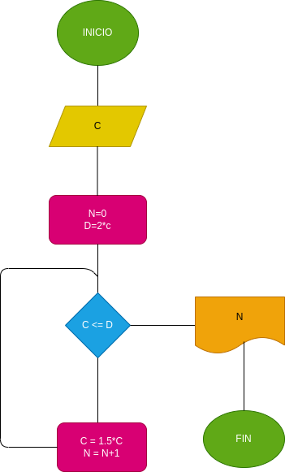

# inter-s-compuesto
En cuanto tiempo es recaudado el doble de un numero ingresado por el usuario mediante interes compuesto

# ANALISIS
--Variables de entrada C : el monto ingresado para hacer el calculo

--variables de proceso Suma : el resultado final de la suma de numeros "C" D = la variables ingresada multiplicada en si misma por 2

--Variables de salida suma : la suma echa

# DISEÑO

# CONSTRUCCION 